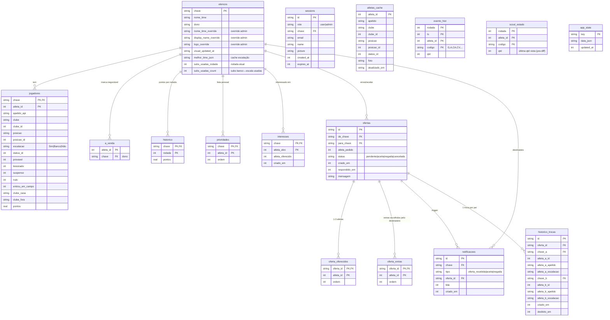

# Schema do banco — SQLite (`/data/app.db`)

**16 tabelas** (schema v2 — consolidado de 31). Diagrama renderiza
automaticamente no GitHub.

## Notas

- **Versão do schema**: `PRAGMA user_version = 2`. Migration in-place do v1
  acontece automaticamente no startup (`lib/db.ts:migrateV1toV2`).
- **PK composta** em `jogadores`, `historico`, `prioridades`, `interesses`,
  `oferta_oferecidos`, `oferta_extras`, `evento_hist`, `scout_estado`.
- **Foreign keys** ativas (`PRAGMA foreign_keys = ON`) com `ON DELETE CASCADE`
  em jogadores → elencos e oferta_oferecidos/extras → ofertas.
- **Helpers**: `lib/app-state.ts` expõe `appStateGet/Set/Delete` pra qualquer
  consumidor. Usuários típicos: `getRodadaStatus`, `getDiasResolucao`,
  `fetchMercadoStatusCacheado`, `isSimulando`.
- **atletas_cache** não tem FK formal pra `jogadores.atleta_id` — jogadores
  podem existir no elenco sem estar no cache do mercado (transferidos pra
  outra liga, fora do Cartola).
- **Trade-off**: perdemos query rápida por email único (era `email_map(email PK)`).
  Agora `emailParaChave(email)` faz `appStateGet("email_map")` + lookup no
  Record JSON. Custo desprezível em ~9 emails.
