# Schema do banco — SQLite (`/data/app.db`)

Diagrama renderiza automaticamente no GitHub. Pra visualizar local, cole
o bloco Mermaid em https://mermaid.live ou abra com qualquer viewer
Markdown que suporte Mermaid (VS Code, GitHub, Obsidian).

```mermaid
erDiagram
    %% ============================================================
    %% TIMES + IDENTIDADE
    %% ============================================================
    elencos ||--o{ jogadores : tem
    elencos ||--o| time_visual : "override visual"
    elencos ||--o{ a_venda : "marca negociável"
    elencos ||--o{ historico : "pontos por rodada"
    elencos ||--o| melhor_time : "cache escalação"
    elencos ||--o{ subs_usadas : "subs por rodada"
    elencos ||--o| draft_ordem : "posição no draft"
    elencos ||--o{ prioridades : "lista de interesse"
    elencos ||--o{ interesses : "interessado em"
    elencos ||--o{ ofertas : "envia/recebe"
    elencos ||--o{ notificacoes : "destinatário"
    elencos ||--o| email_map : "email Google"

    elencos {
        string chave PK
        string nome_time
        string dono
    }
    jogadores {
        string chave PK,FK
        int atleta_id PK
        string apelido_api
        string clube
        int clube_id
        string posicao
        int posicao_id
        string escalacao "Sim|Banco|Não"
        int status_id
        int provavel
        int lesionado
        int suspenso
        int nulo
        int entrou_em_campo
        string clube_casa
        string clube_fora
        real pontos
    }
    time_visual {
        string chave PK,FK
        string nome_time "override"
        string display_name "override"
        string logo "override"
        string updated_at
    }
    historico {
        string chave PK,FK
        int rodada PK
        real pontos
    }
    melhor_time {
        string chave PK,FK
        string computed_json "cache de calcularMelhorTime"
    }
    a_venda {
        int atleta_id PK
        string chave FK "dono"
    }
    subs_usadas {
        int rodada PK
        string chave PK,FK
        int count
    }
    prioridades {
        string chave PK,FK
        int atleta_id PK
        int ordem
    }
    interesses {
        string chave PK,FK
        int atleta_alvo PK
        int atleta_oferecido
        int criado_em
    }

    %% ============================================================
    %% OFERTAS (multi-jogador, 1-3 oferecidos por 1 pedido)
    %% ============================================================
    ofertas ||--o{ oferta_oferecidos : "1-3 atletas"
    ofertas ||--o{ oferta_extras : "N-1 extras escolhidos pelo destinatário"
    ofertas ||--o{ notificacoes : "trigger de notif"
    ofertas ||--o{ historico_trocas : "1 troca por par de jogadores"

    ofertas {
        string id PK
        string de_chave FK
        string para_chave FK
        int atleta_pedido
        string status "pendente|aceita|negada|cancelada"
        int criado_em
        int respondido_em
        string mensagem
    }
    oferta_oferecidos {
        string oferta_id PK,FK
        int atleta_id PK
        int ordem
    }
    oferta_extras {
        string oferta_id PK,FK
        int atleta_id PK
        int ordem
    }
    notificacoes {
        string id PK
        string chave FK
        string tipo "oferta_recebida|aceita|negada"
        string oferta_id FK
        int lida
        int criado_em
    }
    historico_trocas {
        string id PK
        string oferta_id FK
        string chave_a FK
        int atleta_a_id
        string atleta_a_apelido
        string atleta_a_escalacao
        string chave_b FK
        int atleta_b_id
        string atleta_b_apelido
        string atleta_b_escalacao
        int criado_em
        int desfeito_em
    }

    %% ============================================================
    %% AUTH
    %% ============================================================
    email_map {
        string email PK
        string chave FK
    }
    sessions {
        string id PK
        string role "user|admin"
        string chave FK
        string email
        string name
        string picture
        int created_at
        int expires_at
    }
    oauth_state {
        string state PK
        string next
        int exp
    }

    %% ============================================================
    %% CACHES (Cartola API + computed)
    %% ============================================================
    atletas_cache {
        int atleta_id PK
        string apelido
        string clube
        int clube_id
        string posicao
        int posicao_id
        int status_id
        string foto
        string atualizado_em
    }
    partidas_cache {
        int clube_id PK
        string casa
        string fora
    }
    mercado_cache {
        int id PK "singleton id=1"
        string atualizado_em
        string atletas_json "Cartola /atletas/mercado, sem limite 64KB"
    }
    mercado_status_cache {
        int id PK "1=status, 2=partidas"
        string atualizado_em
        string data_json
    }

    %% ============================================================
    %% ESTADO GLOBAL
    %% ============================================================
    rodada_atual {
        int id PK "singleton id=1"
        string status "aguardando|aguardando_inicio|ao_vivo"
        int rodada
        string atualizado_em
        string fechamento_json
    }
    simulando {
        int id PK "singleton id=1"
        int ativo "0|1"
    }
    classificacao {
        int id PK "singleton id=1"
        string data_json "externa via n8n"
    }

    %% ============================================================
    %% DRAFT
    %% ============================================================
    draft_meta {
        int id PK "singleton id=1"
        int ciclo
        int rodada_ciclo "1..5, reseta em 6"
        int rodada_base
    }
    draft_ordem {
        string chave PK,FK
        int ordem
    }
    draft_dias {
        int dia_semana PK "0=dom..6=sab"
    }

    %% ============================================================
    %% EVENTOS AO VIVO (cron polling do scout Cartola)
    %% ============================================================
    evento_hist {
        int rodada PK
        int ts PK
        int atleta_id PK
        string codigo PK "G,A,CA,CV,..."
        int qtd
    }
    scout_estado {
        int rodada PK
        int atleta_id PK
        string codigo PK
        int qtd "última qtd vista (pra diff)"
    }

    %% ============================================================
    %% SIMULAÇÃO ADMIN
    %% ============================================================
    sim_scout {
        int id PK "singleton id=1"
        string data_json "scout por atleta_id"
    }
    sim_partidas {
        int id PK "singleton id=1"
        string data_json "partidas com placares fake"
    }
```

## Notas

- **PK composta** em `jogadores`, `historico`, `subs_usadas`, `prioridades`,
  `interesses`, `oferta_oferecidos`, `oferta_extras`, `evento_hist`,
  `scout_estado`.
- **Foreign keys** ativas (`PRAGMA foreign_keys = ON`) — só nas relações
  cruciais (jogadores → elencos com `ON DELETE CASCADE`, oferta_*→ofertas
  idem). As outras FK são lógicas (por convenção do `chave`).
- **Singletons** (id=1) pra estados globais: `rodada_atual`, `simulando`,
  `classificacao`, `mercado_cache`, `mercado_status_cache`, `draft_meta`,
  `sim_scout`, `sim_partidas`.
- **atletas_cache** não tem FK formal pra `jogadores.atleta_id` —
  jogadores podem existir no elenco sem estar no cache do mercado
  (transferidos pra outra liga, fora do Cartola, etc).
- **JSON em colunas TEXT** pra payloads com schema interno fluido
  (`mercado_cache.atletas_json`, `classificacao.data_json`,
  `rodada_atual.fechamento_json`, `melhor_time.computed_json`,
  `sim_*.data_json`). Tudo o que tem schema fixo virou tabela própria.
- **Índices**: `atleta_id` em jogadores; `chave` + `lida` em notificacoes;
  `(rodada, ts DESC)` em evento_hist; `expires_at` em sessions;
  `status` em ofertas; etc.
